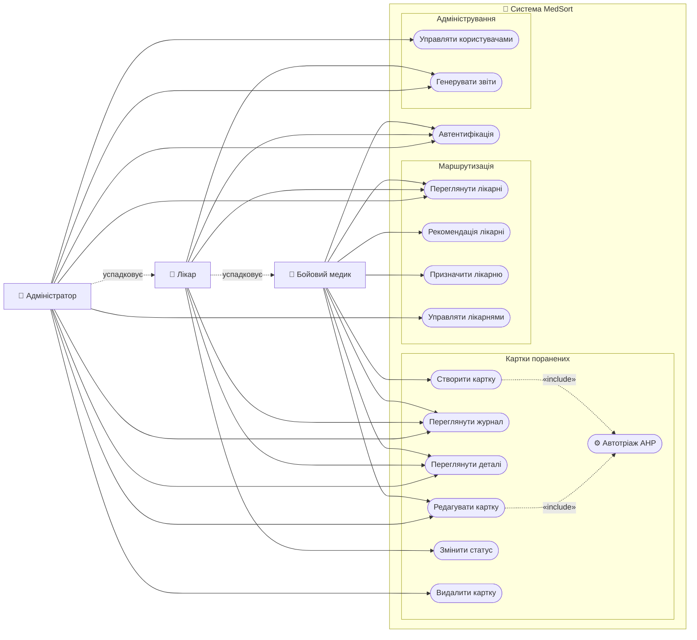

# MedSort — Система медичного сортування та маршрутизації поранених

[](https://nodejs.org/)
[](https://react.dev/)
[](https://www.mongodb.com/)
[](https://expressjs.com/)
[](https://opensource.org/licenses/ISC)

MedSort — це веб-застосунок для автоматизованого медичного тріажу та маршрутизації поранених в умовах бойових дій. Система реалізує метод **AHP (Analytic Hierarchy Process)** для об'єктивного розподілу пріоритетів та рекомендує оптимальну лікарню для кожного пацієнта.

---

## Функціонал

### Тріаж та картки поранених
- Покрокове заповнення картки пораненого (5 кроків)
- Автоматичний розрахунок категорії тріажу за алгоритмом AHP
- Категорії: **RED** (негайна), **YELLOW** (відкладена), **GREEN** (мала), **BLACK** (безнадійна)
- Журнал поранених із пошуком, фільтрацією та пагінацією
- Перегляд деталей картки з історією змін

### Маршрутизація до лікарень
- Перелік медичних закладів із завантаженістю в реальному часі
- Система рекомендацій: підбір найкращої лікарні за відстанню, місткістю та спеціалізацією
- Призначення пораненого до лікарні з автоматичним оновленням завантаженості

### Ролева модель доступу
| Роль | Доступ |
|------|--------|
| `combat_medic` | Створення та перегляд карток |
| `doctor` | Перегляд карток своєї лікарні, зміна статусу |
| `admin` | Повний доступ: управління лікарнями та користувачами, видалення карток |

### Адміністрування (тільки `admin`)
- Додавання / редагування / видалення лікарень
- Управління користувачами: реєстрація, зміна ролей
- Видалення карток поранених із журналу

### Звіти
- Генерація PDF-звітів по поранених

---

## Стек технологій

**Backend**
- Node.js + Express.js
- MongoDB + Mongoose
- JWT-аутентифікація (bcryptjs)
- PDFKit для генерації звітів

**Frontend**
- React 18 + Vite
- React Router v6
- Axios (з auto-unwrap інтерцептором)
- React Icons + Recharts

**Алгоритм**
- AHP (Analytic Hierarchy Process) — зважена оцінка за 5 критеріями: пульс, дихання, свідомість, тиск, тяжкість травми

---

## Вимоги

- [Node.js](https://nodejs.org/) v18+
- [MongoDB](https://www.mongodb.com/) v7+ (локально або Atlas)
- npm v9+

---

## Встановлення та запуск

### 1. Клонування репозиторію

```bash
git clone https://github.com/Zmih54/medsort-system.git
cd medsort-system
```

### 2. Налаштування Backend

```bash
cd server
npm install
```

Створіть файл `.env` у папці `server/`:

```env
PORT=5000
MONGO_URI=mongodb://127.0.0.1:27017/medsort
JWT_SECRET=your_super_secret_key_here
```

### 3. Наповнення бази тестовими даними (опційно)

```bash
cd server
npm run seed
```

Це створить 5 лікарень та 3 тестові акаунти:

| Email | Пароль | Роль |
|-------|--------|------|
| `medic@medsort.ua` | `medic123` | Бойовий медик |
| `doctor@medsort.ua` | `doctor123` | Лікар |
| `admin@medsort.ua` | `admin123` | Адміністратор |

### 4. Налаштування Frontend

```bash
cd client
npm install
```

### 5. Запуск у режимі розробки

**Terminal 1 — Backend:**
```bash
cd server
npm run dev
```
Сервер запуститься на `http://localhost:5000`

**Terminal 2 — Frontend:**
```bash
cd client
npm run dev
```
Застосунок відкриється на `http://localhost:5173`

### 6. Production збірка

```bash
# Збірка frontend
cd client
npm run build

# Запуск backend (буде роздавати статику з client/dist)
cd server
npm start
```

---

## Структура проєкту

```
medsort-system/
├── client/                   # React + Vite застосунок
│   └── src/
│       ├── api/              # Axios конфігурація
│       ├── components/       # Перевикористовувані компоненти
│       ├── context/          # Auth контекст
│       └── pages/            # Сторінки застосунку
│
└── server/                   # Node.js + Express API
    ├── middleware/           # Auth middleware
    ├── models/               # Mongoose моделі
    ├── routes/               # API маршрути
    ├── services/             # Бізнес-логіка (AHP, routing)
    └── index.js              # Точка входу
```

---

## API Endpoints

| Метод | Шлях | Доступ | Опис |
|-------|------|--------|------|
| `POST` | `/api/auth/login` | публічний | Вхід |
| `POST` | `/api/auth/register` | публічний | Реєстрація |
| `GET` | `/api/casualties` | авториз. | Список поранених |
| `POST` | `/api/casualties` | авториз. | Створити картку (+ AHP) |
| `PUT` | `/api/casualties/:id` | авториз. | Оновити картку |
| `DELETE` | `/api/casualties/:id` | admin | Видалити картку |
| `PUT` | `/api/casualties/:id/assign-hospital` | авториз. | Призначити лікарню |
| `GET` | `/api/hospitals` | авториз. | Список лікарень |
| `POST` | `/api/hospitals` | admin | Додати лікарню |
| `PUT` | `/api/hospitals/:id` | admin | Редагувати лікарню |
| `DELETE` | `/api/hospitals/:id` | admin | Видалити лікарню |
| `POST` | `/api/hospitals/recommend` | авториз. | Рекомендувати лікарню |
| `GET` | `/api/reports/...` | авториз. | Генерація звітів |

---

## Алгоритм тріажу AHP

Система оцінює пацієнта за 5 критеріями з різними вагами:

| Критерій | Вага |
|----------|------|
| Пульс (C1) | 0.40 |
| Частота дихання (C2) | 0.25 |
| Рівень свідомості (C3) | 0.20 |
| Систолічний тиск (C4) | 0.10 |
| Тяжкість травми (C5) | 0.05 |

Фінальний бал визначає категорію: `red` (≥7), `yellow` (≥4), `green` (≥2), `black` (<2).

---

## Діаграма прецедентів



> **Легенда:**
> - Суцільні стрілки `→` — участь актора у прецеденті
> - Пунктирні стрілки `⤳ успадковує` — розширення ролі (лікар успадковує права медика, адмін — лікаря)
> - Пунктирні стрілки `⤳ «include»` — обов'язкове включення (створення/редагування картки завжди викликає автотріаж AHP)

---

## Ліцензія

[ISC](https://opensource.org/licenses/ISC)
